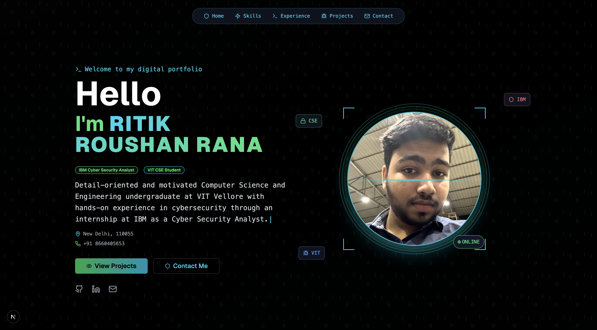

# 🌐 Ritik Roushan's Developer Portfolio

A modern, responsive developer portfolio built using **Next.js 14 (App Router)** and **Tailwind CSS**, showcasing my projects, skills, and contact details.

## 🚀 Live Demo

👉 [Visit My Portfolio](https://ritikrana-me.vercel.app/)

> Deployed with ❤️ using [Vercel](https://vercel.com)

---

## 📸 Preview



---

## 🛠️ Tech Stack

- **Framework**: [Next.js 14 (App Router)](https://nextjs.org/)
- **Styling**: [Tailwind CSS](https://tailwindcss.com/)
- **Deployment**: [Vercel](https://vercel.com/)
- **Icons**: [Lucide React](https://lucide.dev/)
- **Animations**: [Framer Motion](https://www.framer.com/motion/)

---

## ✨ Features

- 🖤 Glassmorphic dark theme UI  
- 📱 Mobile-first responsive layout  
- 🎯 Projects with GitHub/demo links  
- 💡 Skill tags using Tailwind badges  
- 🎞️ Smooth animations (Framer Motion)  
- 📧 Working contact section with `mailto:`

---

## 🧑‍💻 How to Use

Clone and run the project locally:

```bash
# Clone the repository
git clone https://github.com/SHIELD78/your-portfolio-repo.git

# Navigate to the directory
cd your-portfolio-repo

# Install dependencies
npm install

# Start the development server
npm run dev