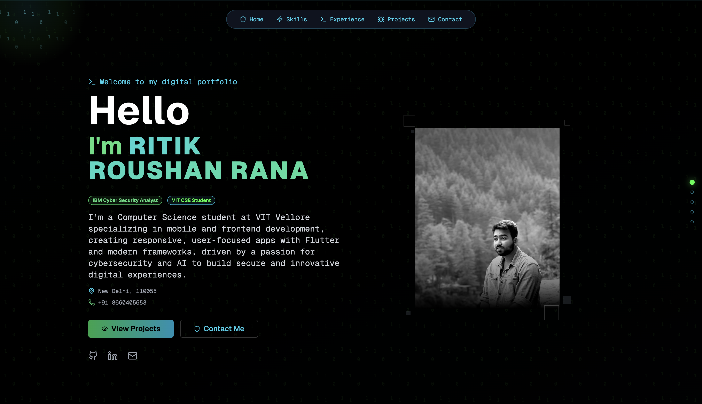

# Ritik Roushan Rana — Developer Portfolio

A single-page developer portfolio built with Next.js (App Router) and Tailwind CSS, covering projects, skills, experience, and contact details.

## Live Demo

[ritikrana-me.vercel.app](https://ritikrana-me.vercel.app/) — deployed on [Vercel](https://vercel.com).

## Preview



## Tech Stack

- **Framework**: [Next.js 15](https://nextjs.org/) (App Router, React 18)
- **Styling**: [Tailwind CSS 3](https://tailwindcss.com/) with `tailwindcss-animate`
- **Icons**: [Lucide React](https://lucide.dev/)
- **Fonts**: [Geist Sans & Geist Mono](https://vercel.com/font)
- **Deployment**: [Vercel](https://vercel.com/)

Animations are plain CSS keyframes declared in `tailwind.config.js`; there is no animation library dependency.

## Features

- Dark terminal-inspired theme with a matrix-style background
- Animated typing effect in the hero section
- Responsive, mobile-first layout
- Project cards with expandable descriptions and tech stacks, linking to GitHub and live demos
- Skills grouped by category, plus an experience and education timeline
- Smooth-scroll navigation and a `mailto:` contact action

## Project Structure

```
app/                 Next.js App Router entry
  layout.tsx         Root layout, fonts, and metadata
  page.tsx           Renders the Portfolio component
  globals.css        Tailwind directives and base styles
components/
  Portfolio.jsx      Main single-page portfolio
  TypingEffect.jsx   Character-by-character typing animation
  ui/                Button and Badge primitives
public/              Static assets (profile photo, preview image)
```

## Getting Started

Requires Node.js 18.18 or newer.

```bash
# Clone the repository
git clone https://github.com/SHIELD78/Portfolio.git
cd Portfolio

# Install dependencies
npm install

# Start the development server
npm run dev
```

The app runs at [http://localhost:3000](http://localhost:3000).

## Scripts

| Command | Description |
| --- | --- |
| `npm run dev` | Start the development server |
| `npm run build` | Create a production build |
| `npm run start` | Serve the production build |
| `npm run lint` | Run ESLint |

## Contact

- Email: ritikrana8596@gmail.com
- GitHub: [@SHIELD78](https://github.com/SHIELD78)
- LinkedIn: [Ritik Roushan Rana](https://www.linkedin.com/in/ritik-roushan-rana-b6a89528a/)
